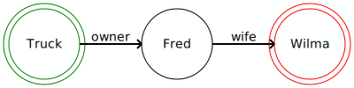
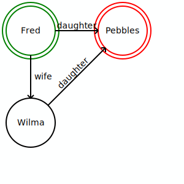
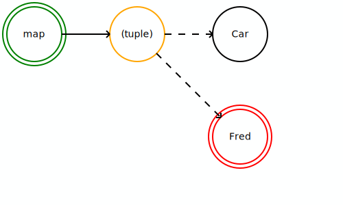
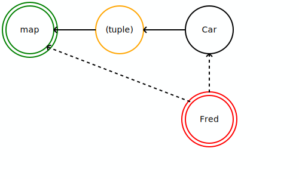

# Theory of the case (as of 2025-02-21)

This document will start with some fundamentals of JavaScript, and of object-oriented programming in general.  From these axioms, I will craft a theory of how to actually extract these references and collect the information we need to answer the question, "is this object _reachable_ from these other objects?"

## What are I trying to do? (Goals)

### Show how we get from a set of "held objects" to a target object

Ideally, we could just call a function in JavaScript to determine if there's a chain of custody from one set of objects to the target object.

### Show if the target is held strongly by the held values (directly or indirectly)

I really want to know if I'm inadvertently leaking memory by holding a strong reference I lost track of, or causing this as a side effect I didn't anticipate.

### Run multiple searches

If I can ask this question once, there's no real reason I can't ask the question again, with different sources or targets.

## What we know about objects in JavaScript (Axioms of JavaScript)

### Objects refer to other objects via properties

JavaScript objects have properties which can refer to primitives (strings, numbers, true, false, undefined, etc.) and to other objects.

```javascript
const Truck = {
  type: "Automobile",
  owner: {
    firstName: "Fred",
    lastName: "Flintstone"
  }
}
```

JavaScript has arrays, which provide ordered properties:

```javascript
const names = ["Fred", "Wilma", "Barney", "Betty"];
console.log(names[2]); // "Barney"
```

JavaScript also has [_symbols_](https://developer.mozilla.org/en-US/docs/Web/JavaScript/Reference/Global_Objects/Symbol), which we can use to define properties.

```javascript
const TYPE_KEY = Symbol("type");

const Truck = {
  [TYPE_KEY]: "Automobile",
  owner: {
    firstName: "Fred",
    lastName: "Flintstone"
  }
}
```

### JavaScript classes define objects with "private" and "static" properties and methods

It's quite common to see TypeScript classes like this, which compile down to JavaScript:

```typescript
class Automobile {
  static type = "Automobile";
  #owner: Person;

  constructor(owner: Person) {
    this.#owner = owner;
  }

  getOwner(): Person {
    return this.#owner;
  }
}

class Truck extends Vehicle {
  readonly powerSource: "battery" | "diesel";

  constructor(owner: Person, powerSource: "battery" | "diesel") {
    super(owner);
    this.powerSource = powerSource;
  }
}
```

The `#owner` property of the `Automobile` is not directly accessible.  These are [private class fields](https://developer.mozilla.org/en-US/docs/Web/JavaScript/Reference/Classes/Private_properties).  This differs very much from TypeScript's `private` annotation, which isn't _really_ private when TypeScript compiles to JavaScript.

Similarly, the class has a static `type` property.  Anyone can access that.  For purposes of our "is it reachable" question, I will consider those reachable by instances of the class.

There are private static class fields too.

### References can be indirect, via other references

```javascript
const Wilma = {
  firstName: "Wilma",
  lastName: "Flintstone",
}
const Fred = {
  firstName: "Fred",
  lastName: "Flintstone",
  wife: Wilma
};

const Truck = {
  type: "Automobile",
  owner: Fred
}

console.log(Truck.owner.wife.firstName); // "Wilma"
```

### References can be strong or weak

JavaScript usually holds properties of objects strongly, meaning if you have a `Truck` and the truck has an `owner` property pointing to a `Person`, then you can _reach_ that `Person` any time you want.

But [sometimes the reference is weak](https://developer.mozilla.org/en-US/docs/Web/JavaScript/Reference/Global_Objects/WeakRef):

```javascript
const Fred = {
  firstName: "Fred",
  lastName: "Flintstone"
};

const BlindTrust = new WeakRef(Fred);

const Truck = {
  type: "Automobile",
  owner: BlindTrust
}

console.log(Truck.owner.deref().firstName); // "Fred"
```

While the `Truck` does hold a reference to Fred, it is not a _strong_ reference.  Strong references (such as properties) guarantee the existence of an object they refer to.  Weak references do not.  

The object a weak reference actually refers to _must_ exist _only if_ another object holds a strong reference to it.  If the only references to the object are weak, the JavaScript engine _may_ decide to delete that weakly held object, in this case `Fred`.

Can you see where there is a strong reference to `Fred` here?

If you said, "by the constant declaration", you're right.  We're in the top-level _scope_, so `globalThis.Fred === Fred`.  Consider another example:

```javascript
class Person {
  firstName;
  lastName;

  constructor(firstName, lastName) {
    this.firstName = firstName;
    this.lastName = lastName;
  }
}

const BlindTrust = new WeakRef(new Person("Fred", "Flintstone"));
const Truck = {
  type: "Automobile",
  owner: BlindTrust
}

// do many other operations

console.log(Truck.owner.deref().firstName); // this could throw an exception
```

Here, `Truck.owner.deref()` could return `undefined`.  Or it could return the `Person`.  Again, this is because _nobody_ holds a strong reference to the person.  I can't even say `Fred` here, because I didn't create a `const Fred = /*...*/` this time for the Person.

This is not a bug in the language.  It's a feature.  It's very much intentional, and useful when you _want_ the JavaScript engine to clean up objects you don't necessarily need any more.  (That said, use of `WeakRef` objects is discouraged "unless you know what you are doing".)

The challenge lies in defining, and (for this project) detecting, when the number of strong references to an object is _zero_... or if it's non-zero, _who_ is holding the object.

### Sets have references to values

```javascript
const allMyVehicles = new Set();
const Truck = {
  type: "Automobile",
}

allMyVehicles.add(Truck);

for (const vehicle of allMyVehicles) {
  console.log(vehicle.type); // "Automobile"
}
```

`Set` instances hold strong references to their members.  As long as I have the `allMyVehicles` set, I have a way to get to my `Truck`.

_However_, this does not manifest itself as a _named property_ of the Set.  So without iterating over the Set, you can't just discover the `Truck` inside.

```javascript
const allMyVehicles = new WeakSet();
const Truck = {
  type: "Automobile",
}

allMyVehicles.add(Truck);

// `Truck` is unreachable from `allMyVehicles`.

console.log(allMyVehicles.has(Truck)); // true
```

`WeakSet` instances are _not_ iterable.  The `Truck` is held weakly in this case.  Like the `WeakRef`, the members of a `WeakSet` are unreachable from inside the JavaScript engine.

### Maps have references to keys and values

```javascript
const Barney = {
  firstName: "Barney",
  lastName: "Rubble",
};

const Bicycle = {
  type: "Two-wheeler",
}

let vehicleToOwnerMap = new Map();
vehicleToOwnerMap.set(Bicycle, Barney);

console.log(vehicleToOwnerMap.get(Bicycle).firstName); // Barney

for (const value of vehicleToOwnerMap.values()) {
  console.log(value.lastName); // "Rubble"
}
```

This may be obvious to any seasoned JavaScript developer:  you can get to the keys and values of a `Map`, as the `Map` holds strong references to both.

What's _not_ obvious is you actually need _both_ the key _and the map_ to look up the value.  Sure, I just iterated over all the values, but that's partly because the map holds the keys strongly.  (In reality, this may be a false claim, as `Map` objects by definition hold both.)

If I had then done:

```javascript
vehicleToOwnerMap = undefined;
```

Barney becomes unreachable from the remaining key, `Bicycle`.  I could've done `vehicleToOwnerMap.clear();` instead, and that would have the same effect.

This point about two joint owners of the reference to `Barney` is much more tangible with a `WeakMap`.

```javascript
const Barney = {
  firstName: "Barney",
  lastName: "Rubble",
};

const Bicycle = {
  type: "Two-wheeler",
}

let vehicleToOwnerMap = new WeakMap();
vehicleToOwnerMap.set(Bicycle, Barney);

console.log(vehicleToOwnerMap.get(Bicycle).firstName); // "Barney"

// The weak map is not enumerable, so we can't get to Barney without both the map and the bicycle.
```

So if either `allVehicles` or `Bicycle` is unreachable, then `Barney` is unreachable.

This is one of the points that bears repeating:  if _anything_ holds a strong reference to the weak map, and _anything_ holds a strong reference to the key, then the value is reachable.  In fact, it's one of the most important details in modeling a search for references.

### Several of the references are inacccessible within a JavaScript engine without other references

Specifically,

- `WeakRef`'s internal value
- `WeakMap`'s keys and values
- `WeakSet`'s values
- `FinalizationRegistry` (to the registered values, held values and unregister tokens)
- `Proxy` (to the proxy target and the proxy handler)
- `Proxy.revocable` (from the revoker function to the proxy... [this has caused some pain](https://issues.chromium.org/issues/42201499) [in the past](https://bugzilla.mozilla.org/show_bug.cgi?id=1694781))
- private class fields
- `Promise` callbacks
- and so on.

There's no method of `Object` or `Reflect` that will _guarantee_ you all the values these hold are reachable.  Again, this is intentional, but it does make searching all references impossible from _completely_ inside a script.

### The ECMAScript standard defines these behaviors for JavaScript engines

[The ECMA TC-39 Working Group](https://tc39.es) maintains the ECMAScript standard, which defines the core of the JavaScript language.  So everything I just described comes from the [ECMA-262 specification](https://tc39.es/ecma262/).

### One object is "reachable" from another object if there is a chain of references from the latter object to the former

This point is worth emphasizing again, as a example of what it means to be "reachable".  I will skip writing a formal definition.

```javascript
const Wilma = {
  firstName: "Wilma",
  lastName: "Flintstone",
}
const Fred = {
  firstName: "Fred",
  lastName: "Flintstone",
  wife: Wilma
};

const Truck = {
  type: "Automobile",
  owner: Fred
}
```

From `Truck`, we can reach `Wilma`:  `Truck.owner.wife === Wilma`.

The same is not true for the `BlindTrust` example:

```javascript
class Person {
  firstName;
  lastName;

  constructor(firstName, lastName) {
    this.firstName = firstName;
    this.lastName = lastName;
  }
}

const BlindTrust = new WeakRef(new Person("Fred", "Flintstone"));
const Truck = {
  type: "Automobile",
  owner: BlindTrust
}

// no guaranteed way to reach the person:  BlindTrust.deref() might return undefined, or Fred Flintstone.
```

## What we know about objects in any object-oriented programming language (Axioms of graph theory)

### Graph theory has concepts for these ideas already (with some translation)

In graph theory, we build a graph from _nodes_ and _edges_.  The nodes in our case define values, and the edges define how you get from one value to another.

### We can represent these objects in graph theory

```javascript
const Wilma = {
  firstName: "Wilma",
  lastName: "Fredstone"
}

const Fred = {
  firstName: "Fred",
  lastName: "Flintstone",
  wife: Wilma
};

const Truck = {
  type: "Automobile",
  owner: Fred
}
```



We would consider `Truck` and `Fred` as _nodes_, and there is a _directed edge_ (the property name "owner") from `Truck` to `Fred`.

This is partly incomplete, though.  Recall the `WeakMap` example above.  There, you need _two_ objects (the map and the key) to refer to a value.  So a simple "map owns key and key owns value" pair of edges isn't enough.

Graph theory depends on a single edge from one node to one node.  Period.  This is an apparent contradiction, but I'll come back to that in a moment.

### Multiple graph edges can refer to a graph node

```javascript
const Pebbles = {
  firstName: "Pebbles",
  lastName: "Rubble"
}

const Wilma = {
  firstName: "Wilma",
  lastName: "Fredstone",
  daughter: Pebbles,
}

const Fred = {
  firstName: "Fred",
  lastName: "Flintstone",
  wife: Wilma,
  daughter: Pebbles
};

```



### We can define new nodes and edges if we need to

How would we represent a `WeakMap` key-value relationship?

```javascript
const Barney = {
  firstName: "Barney",
  lastName: "Rubble",
};

const Bicycle = {
  type: "Two-wheeler",
};

let vehicleToOwnerMap = new WeakMap();
vehicleToOwnerMap.set(Bicycle, Barney);
```

From the perspective of the weak map ("who do I refer to"), the graph looks like this:



From the perspective of Fred ("who owns me"), the graph is slightly different:



This distinction matters, and it's why I have two different types of edges in my graphs.  The former represents _references_.  The latter represents _ownership_.

## A side note

When I started this project, I was thinking this was just a traversal: start from a set of objects we presume to hold, and see if we can reach a target object.  But then I started thinking, "if the set of objects includes `globalThis`, isn't this a little like the mark operation of mark-and-sweep garbage collection?`  Then there was this sentence on MDN about [garbage collection](https://developer.mozilla.org/en-US/docs/Web/JavaScript/Memory_management#release_when_the_memory_is_not_needed_anymore):

"...the general problem of determining whether or not a specific piece of memory is still needed is [undecidable](https://en.wikipedia.org/wiki/Decidability_%28logic%29)."

Uh-oh.  Have I entered into a holodeck that won't let me out?

No.  My confusion stemmed from [the difference between "syntactic garbage" and "semantic garbage"](https://en.wikipedia.org/wiki/Tracing_garbage_collection#Reachability_of_an_object).  Wikipedia's explanation is refreshingly clear.  (Though I would prefer to cite an academic source, one less likely to change after I write this.)

Simply put, I'm more interested in what objects are reachable, and less so in trying to decide if we've passed a point where we don't need an object.  The reason I'm interested is that's what the JavaScript engine will be tracking.

## What do we need to capture?  (Data, Requirements)

- Objects as graph nodes, first because that's what they are mathematically, and second because there are good tools to visualize graphs.
- References from a parent object to a child object ("parent-to-child edges").  This is one class of edge, primarily to tell us the property name, internal slot, etc. on "how we get there".
- Is it a strong reference, or is the child held weakly (say, as a key in a `WeakMap`)?
- Ownership of an object: what nodes have to be held strongly for a child node to be held strongly?  ("child-to-parent edges")

## What can we use to capture and show this data?  (Tools)

### A separate JavaScript engine: engine262

I've mentioned several ways where we can't inspect the internal values of an object (private class fields, weak map keys, etc.)... _within_ the JavaScript scope being run.  They're inacccessible.

So, I don't try.  Instead, I run the JavaScript code I wish to exercise in _another JavaScript engine_.  One where we can access those pesky internal slots from the outside.

The `engine262` project is perfect for this.  It's a JavaScript implementation of an ECMAScript engine, to run in NodeJS ([or a web browser](https://engine262.js.org/), if you're so inclined).  My approach is to create a new built-in function, `searchReferences()`, for scripts running in `engine262` to call.  This gives me a sandbox to make sure I haven't brought anything non-ECMAScript in, and I can inspect the internal slots of `engine262` to answer my questions.

The `searchReferences()` method takes four arguments:

```typescript
/**
 * @param resultKey - an unique string key so searches can be distinguished from one another.
 * @param targetValue - the target we're searching for.
 * @param heldValues - the objects we presume are held strongly
 * @param strongReferencesOnly - true if we should ignore weak references.
 */
declare function searchReferences(
  this: void,
  resultsKey: string,
  targetValue: object,
  heldValues: readonly object[],
  strongReferencesOnly: boolean,
): void;
```

### JSON

Serializing and later parsing the data is paramount.  ECMAScript supports the JSON standard, which is a natural fit for this.

One conscious decision I am making is to represent all objects by a numeric identifier, and all graph edges by another.  The reason is, aside from the held values array and the target value, no object in this graph is more important than any other.

The target value will have id 0, and the held values array will have id 1.

I may change my mind on this later, for purposes of fitting into a conventional graph definition in the next section.

### graphlib and dagre

Once we have our extracted graph, showing how we get from the held values to the target, it would be really nice to create a visualization of that.  This transitions us from NodeJS to browsers, or more precisely from an environment where we don't need a GUI to one where we do.

The `graphlib` library allows defining nodes and edges of a graph formally, and transform between serialized JSON and the graph.  `Dagre` is a tool for computing where, given certain constraints, these nodes and edges _should live in a coordinate space_ for rendering.

### D3 or Cytoscape

Here, we're firmly in a web browser environment:  `D3` provides tools to build SVG graphs from the output `Dagre` generates, while `Cytoscape` generates canvas elements.

[I will note I was unsuccessful in using dagre, D3 and Cytoscape my first time.](./source/dagre-tools/README.md)  That's because I was trying too hard to do something quickly.  This is going to require a bit more study on my part to integrate properly.

## How can we use these tools?  (Approach)

- Define a special directory, `reference-spec`, for ECMAScript standard-compliant code plus the `searchReferences()` function to live in.
- Craft a driver to invoke `engine262` on the `reference-spec` files, with an implementation of the `searchReferences()` built-in function.
- Create a set of classes to represent the ECMAScript objects as nodes and the relationships as edges.  (I'll worry about formal graph definitions later.)
- The implementation for `searchReferences` will do three operations:
  - Create a graph of objects and references from the held values array.
  - If `strongReferencesOnly` is true, search the graph for strong references to the target value.
  - Create another graph from the first graph, copying only the objects and references connecting the target to the held values.
- Write many tests to exhaustively confirm this approach works in small bites, recursively.
- Write a couple of larger realistic integration tests to confirm the data model is good.
- Formalize the graph structure for feeding to `dagre` and `graphlib`.
- Feed the graph structures and verify the `dagre` coordinates are indeed useful.
- Provide API to run a `reference-spec` file and output the resulting graphs for consumers.
- Build out a HTML-based tool integrating the output with rendering libraries, for the visualization. (Help really wanted with this!)
